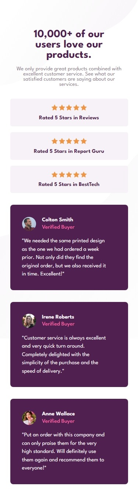
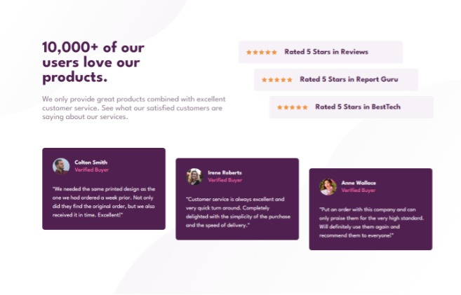

# Frontend Mentor - Social proof section solution

This is a solution to the [Social proof section challenge on Frontend Mentor](https://www.frontendmentor.io/challenges/social-proof-section-6e0qTv_bA). Frontend Mentor challenges help you improve your coding skills by building realistic projects.

## Table of contents

- [Overview](#overview)
  - [The challenge](#the-challenge)
  - [Links](#links)
  - [Screenshot](#screenshot)
- [My process](#my-process)
  - [Built with](#built-with)
  - [What I practiced](#what-i-practiced)
  - [Continued development](#continued-development)
- [Author](#author)

## Overview

### The challenge

Users should be able to:

- View the optimal layout for the section depending on their device's screen size

### Links

- Solution URL: [Frontend Mentor](https://www.frontendmentor.io/solutions/social-proof-section-using-css-grid-18kBz42wcj)
- Live Site URL: [GitHub Page](https://ax-cd.github.io/social-proof-section-challenge/)

### Screenshot

## My process

### Built with

- HTML5
- CSS3
- CSS Grid
- Flexbox
- Mobile-first workflow

### What I practiced

This challenge was good to practice placing elements using CSS Grid, as well as background images using the ::before and ::after selectors.

## Author

- GitHub - [Ax-cd](https://github.com/Ax-cd)
- Frontend Mentor - [@Ax-cd](https://www.frontendmentor.io/profile/Ax-cd)
- Instagram - [@ax.coding](https://www.instagram.com/ax.coding/)
